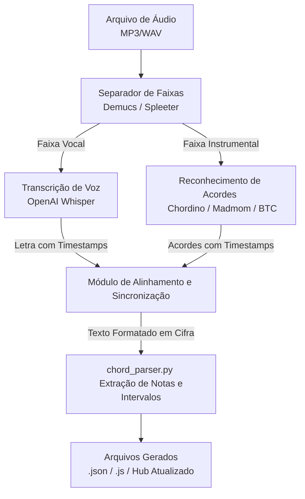

# Plano de Arquitetura: Pipeline de Áudio para Cifra (Audio-to-Cifra)

Este documento descreve as estratégias e propostas técnicas para gerar cifras completas e estruturadas (no formato `.json` / `.js` do nosso catálogo) a partir de arquivos brutas de áudio (`.mp3`, `.wav`, `.m4a`).

---

## Opção 1: Pipeline Algorítmico Automatizado (IA Especializada + MIR)

Uma abordagem modular unindo modelos de *Speech-to-Text* para a letra e *Music Information Retrieval (MIR)* para a harmonia.

### Etapas Detalhadas:
1. **Pré-processamento / Separação de Áudio (Demucs):**
   - Isolar a faixa vocal das faixas instrumentais garante que a bateria e a voz não interfiram na detecção de notas harmônicas, e que os instrumentos não atrapalhem a transcrição da letra.
2. **Transcrição e Temporalidade (OpenAI Whisper):**
   - Transcrição da letra linha a linha, extraindo os *timestamps* iniciais e finais de cada verso (`word-level` ou `line-level timestamps`).
3. **Detecção Harmônica (Chordino / BTC / Madmom):**
   - Análise do espectro de frequências (chromagram) da faixa instrumental para identificar a sequência harmônica ao longo do tempo (ex: `0s-4s: Cmaj7`, `4s-8s: Dm7`).
4. **Módulo de Alinhamento (`cifra_from_audio.py`):**
   - Cruza a linha do tempo dos acordes com a linha do tempo das palavras.
   - Posiciona o texto do acorde na linha imediatamente superior, no índice de caractere correspondente à palavra cantada daquele instante.
5. **Integração com o Catálogo Atual:**
   - Envia a cifra recém-montada para o nosso `chord_parser.py`, que gera as posições no teclado de 2 oitavas e salva no padrão `SONG_DATA`.

---

## Opção 2: Abordagem via LLMs Multimodais de Áudio

Utilização de grandes modelos de linguagem nativamente multimodais (como **Gemini 1.5 Pro / 2.0 Flash**) capazes de processar áudio longo diretamente.

### Fluxo de Trabalho:
1. Envio do arquivo de áudio diretamente na API/Interface multimodal.
2. **Prompt Estruturado:**
   > *"Ouça este áudio atentamente. Transcreva a letra completa dividida em versos e identifique os acordes harmônicos precisos (incluindo inversões e dissonâncias) que acompanham cada parte. Retorne no formato de cifra tradicional, com a linha de acordes posicionada exatamente acima das sílabas em que ocorrem as mudanças."*
3. O modelo gera o texto em formato de cifra.
4. Passamos a saída bruta para o nosso pipeline já existente (`parse_plaintext_tab`) no `gerar_musica.py` para gerar os arquivos e catalogar.

---

## Opção 3: Pipeline Semi-Automático (Alta Precisão para Samba/MPB)

Ideal para harmonias ricas (acordes diminutos, meio-diminutos, extensões complexas) onde algoritmos puramente automáticos podem simplificar ou errar inversões de baixo.

### Fluxo de Trabalho:
1. **Transcrição Automática da Letra:** O Whisper gera a letra limpa e dividida em versos.
2. **Análise Assistida por Áudio/Visual:**
   - Utiliza-se softwares como **Sonic Visualiser** (com plugin Chordino), **Chordify** ou **Riffstation** para extrair um guia inicial dos acordes e seus tempos de mudança.
3. **Revisão e Enriquecimento Humano:**
   - O usuário ou revisor ajusta os acordes finos (ex: corrigindo um `Dm` para `Dm7(b5)`) em um arquivo `.txt` simples com a letra já alinhada.
4. **Ingestão no Sistema:**
   - Executa-se `python tools/gerar_musica.py minha_cifra.txt` para converter automaticamente em `.json`, `.js` e atualizar o hub de navegação.

---

## Comparativo Final

| Critério | Opção 1 (MIR + Whisper) | Opção 2 (LLM Multimodal) | Opção 3 (Semi-Automático) |
| :--- | :--- | :--- | :--- |
| **Automação** | 100% Automático | 100% Automático | Misto (Requer revisão) |
| **Precisão da Letra** | ⭐⭐⭐⭐⭐ (Excelente) | ⭐⭐⭐⭐ (Muito Boa) | ⭐⭐⭐⭐⭐ (Excelente) |
| **Precisão Harmônica (Samba/MPB)** | ⭐⭐⭐ (Boa para acordes base) | ⭐⭐⭐ (Depende da clareza do áudio) | ⭐⭐⭐⭐⭐ (Perfeita/Curada) |
| **Custo Computacional / Setup** | Médio (Requer modelos locais/APIs) | Baixo (Apenas chamada de API) | Baixo (Ferramentas simples) |
